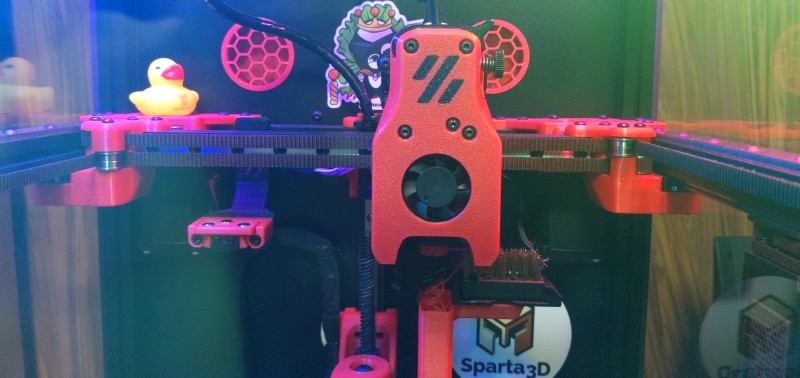
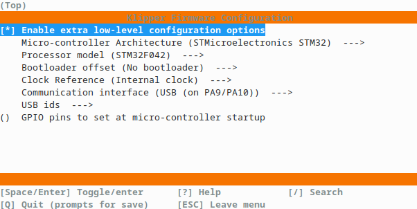
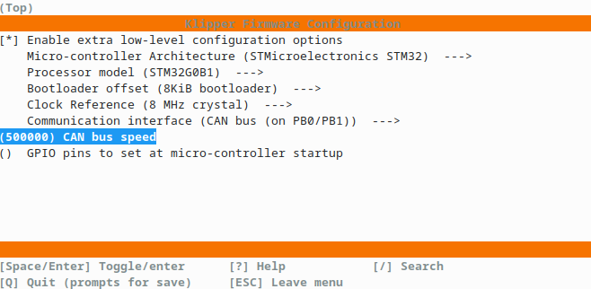

# Automated Klipper Config Backup



## General Information

### Fabreeko HoneyBadger SF160 : VT.775 : SF.008

Welcome to the online public backup of my printer configuration. The scripts, macros, and configuration files you will find here are an assorted collection of bits I've found over many years, and a few little pieces of my own creation, all mashed together to make my printer run the way I like it to.

Disclaimer: Do **NOT** blindly copy code from the internet into your own printer's config - there is a high possibility of things not working or something being damaged.  I keep this backup folder as complete as possible to benefit myself (it is my backup after all), where many repo's exclude things like saved_variables.  I make it public to benefit everyone else *as a reference only*.  Learn from it, use pieces of it - but don't come complaining if eg. something in my custom Z-offset handling put a scratch in your PEI.  Everything you find here you use at your own risk.

### Mods

* [Dishwasher](https://github.com/CadmonkeyFPV/Salad_Fork/tree/master/MODS/Dishwasher) nozzle-cleaning brush
* [Unklicky probe](https://github.com/majarspeed/Unklicky/tree/main/Unklicky_Probes/Unklicky)
* RGB LED strips with [led_effect](https://github.com/julianschill/klipper-led_effect) plugin
* Automatic backups to github

### Hardware

* BTT Manta M8P
* BTT CB1
* BTT U2C V2.0
* BTT EBB36 CAN toolboard
* E3D Revo Voron
* V0 Display

## Firmware

### Main MCU: *mcu*
BTT Manta M8P V1.0 - stm32g0b1xx


```
cd ~/klipper
cp .config.m8p .config
make clean
make
make flash FLASH_DEVICE=/dev/klipper/MCU
```

### MCU Embedded in V0 Display: *Display*
V0 Display - stm32f042


```
cd ~/klipper
cp .config.V0Display .config
make clean
make
# Install boot jumper and reset board
make flash FLASH_DEVICE=0483:df11
# Remove boot jumper and reset board
```

### BTT U2C V2.0
Runs binary-blob Candlelight fw from BTT

```
cd ~/U2C
wget https://github.com/bigtreetech/U2C/raw/master/firmware/U2C_V2_STM32G0B1.bin
# Disconnect USB from U2C, hold 'boot' button while reconnecting
dfu-util -l
dfu-util -D ./U2C_V2_STM32G0B1.bin -s"207F32725841", -a 0 -s 0x08000000:leave
# Disconnect and reconnect USB from U2C to reboot it
```

/etc/network/interfaces.d/can0:
```
allow-hotplug can0
iface can0 can static
    bitrate 500000
    up ifconfig $IFACE txqueuelen 128
```

### Toolhead board: *EBB*
BTT EBB36 V1.2 - stm32g0b1xx

Katapult (was CanBoot)
```
cd ~/katapult
make clean
make
# Get connected to EBB in DFU mode over USB
dfu-util -a 0 -D out/katapult.bin -s 0x08000000:mass-erase:force:leave
# Return EBB to connection over CAN
```



Klipper (flash over CAN)
```
cd ~/klipper
cp .config.EBB36 .config
make clean
make
~/katapult/scripts/flash_can.py -i can0 -q
~/katapult/scripts/flash_can.py -f ~/klipper/out/klipper.bin -i can0 -u 09bcd938d1f5
```